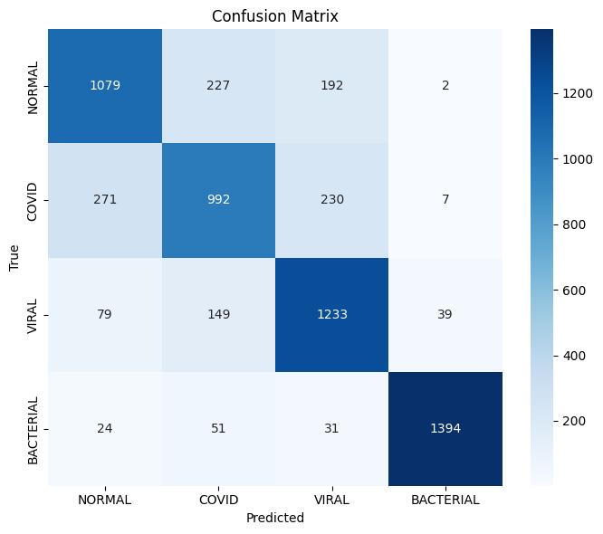
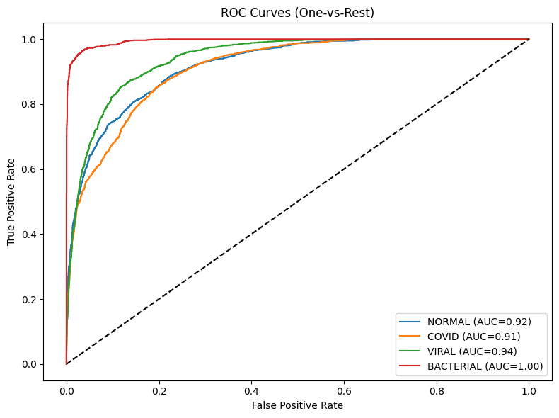
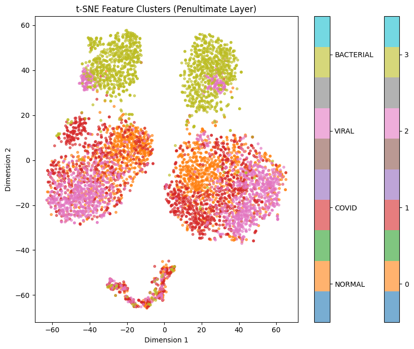
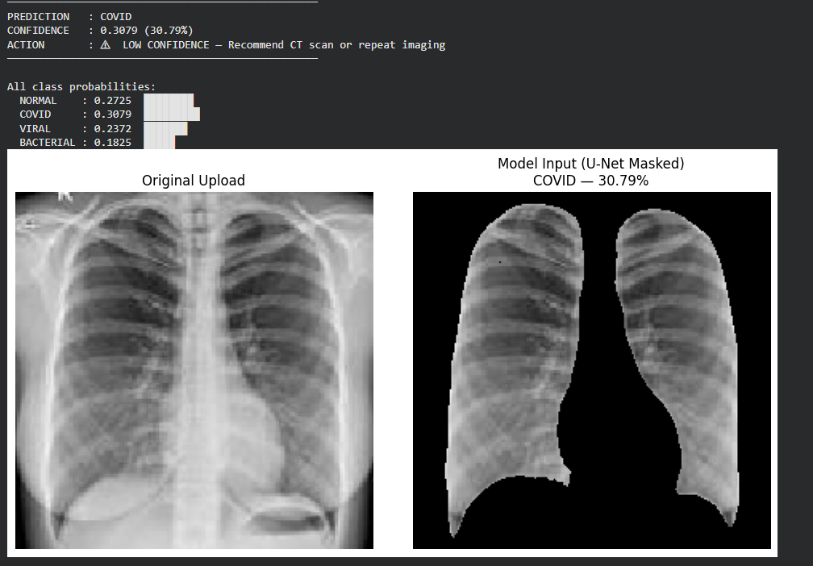

# 🩺 Lung-Region Focused Deep Learning Framework for Multi-Class Pneumonia Detection Using EfficientNetV2 and Confidence-Aware Decision Support

A clinically oriented deep learning framework for **multi-class pneumonia detection from chest X-ray images**, combining **lung-region segmentation, EfficientNetV2 classification, confidence calibration, explainability, and decision support**.

Developed as part of the **MSc Data Science Dissertation – University of Kerala**.

---

## 📌 Project Overview

This project proposes an **end-to-end two-phase medical imaging pipeline** for detecting pneumonia from chest X-rays while prioritizing:

* Reliability
* Interpretability
* Clinical applicability
* Confidence-aware decision support

Unlike conventional classification-only approaches, this framework first isolates **lung regions using U-Net segmentation**, then performs classification using **EfficientNetV2-B0**.

A key design principle is that **provided lung masks are used only for U-Net supervision**. During inference, the trained U-Net autonomously generates masks from raw X-rays, enabling real-world deployment.

---

## 🎯 Objectives

This framework aims to:

* Classify chest X-rays into:

  * Normal
  * COVID-19 Pneumonia
  * Viral Pneumonia
  * Bacterial Pneumonia
* Restrict model attention to clinically relevant lung regions
* Improve reliability using confidence calibration
* Enhance interpretability through explainable AI
* Support clinical workflows through confidence-based decision routing

---

# 🧠 Key Features

✅ Lung-region focused preprocessing using U-Net
✅ EfficientNetV2-B0 transfer learning classifier
✅ Two-stage training strategy
✅ Confidence calibration using Temperature Scaling
✅ Explainability using Occlusion Sensitivity
✅ Feature visualization using t-SNE
✅ Confidence-aware clinical decision support
✅ Real-world inference pipeline

---

# 🏗 System Architecture

```text
Chest X-ray Input
        ↓
Preprocessing & Cleaning
        ↓
U-Net Lung Segmentation
        ↓
Lung Mask Application
        ↓
Quality Verification
        ↓
EfficientNetV2-B0 Classification
        ↓
Probability Output
        ↓
Explainability Analysis
        ↓
Confidence Calibration
        ↓
Decision Support System
```

---

# ⚙️ Methodology

## Phase 1 — Lung Segmentation

### U-Net

* Supervised training using image-mask pairs
* Generates masks automatically on unseen X-rays
* Binary segmentation output

### Preprocessing

* Resize → 224 × 224
* Normalization
* Brightness enhancement
* Quality verification

---

## Phase 2 — Pneumonia Classification

### EfficientNetV2-B0

Transfer learning approach:

### Stage 1 — Feature Extraction

* Frozen backbone
* Train classification head

### Stage 2 — Fine-Tuning

* Top 30 layers unfrozen
* Domain adaptation

### Classification Classes

| Class     | Description                 |
| --------- | --------------------------- |
| NORMAL    | Healthy lungs               |
| COVID     | COVID-19 Pneumonia          |
| VIRAL     | Viral Pneumonia             |
| BACTERIAL | Lung Opacity (mapped proxy) |

---

# 📊 Results

## Final Test Performance

| Metric                   | Value      |
| ------------------------ | ---------- |
| Accuracy                 | **78.30%** |
| Macro F1 Score           | **0.78**   |
| Test Loss                | **0.5327** |
| Best Validation Accuracy | **77.93%** |

---

## Per-Class Performance

| Class     | Precision | Recall | F1   |
| --------- | --------- | ------ | ---- |
| NORMAL    | 0.74      | 0.72   | 0.73 |
| COVID     | 0.70      | 0.66   | 0.68 |
| VIRAL     | 0.73      | 0.82   | 0.77 |
| BACTERIAL | 0.97      | 0.93   | 0.95 |

---

## Key Findings

* Best performance observed for **Bacterial Pneumonia**
* COVID and Viral classes show expected radiographic overlap
* Calibration improved confidence reliability
* Strong ROC-AUC performance across classes

---
# 📸 Results Preview

## Confusion Matrix

<p align="center">

</p>

---

## ROC Curve

<p align="center">

</p>

---

## t-SNE Feature Visualization

<p align="center">

</p>

---

## Explainability — Occlusion Sensitivity

<p align="center">

</p>

---

## Sample Prediction

<p align="center">

</p>
# 📈 Evaluation Metrics

The model was evaluated using:

* Accuracy
* Precision
* Recall
* F1-Score
* Confusion Matrix
* ROC Curve
* Precision-Recall Curve
* Misclassification Analysis

---

# 🔍 Explainability

To improve model transparency:

## Occlusion Sensitivity

Highlights image regions contributing most to predictions.

## t-SNE Visualization

Visualizes feature separability using penultimate-layer embeddings.

---

# 📉 Confidence Calibration

Temperature Scaling was applied to reduce model overconfidence.

Decision Routing:

| Confidence         | Action                               |
| ------------------ | ------------------------------------ |
| ≥ 0.80 (Normal)    | Standard follow-up                   |
| ≥ 0.80 (Infection) | Clinical protocol                    |
| 0.60–0.80          | Expert radiologist review            |
| < 0.60             | Recommend CT / further investigation |

---

# 📦 Dataset

Dataset used:

**COVID-19 Radiography Database**

🔗 https://www.kaggle.com/datasets/tawsifurrahman/covid19-radiography-database

---

## Dataset Structure

```text
data/

Normal/
COVID/
Viral Pneumonia/
Lung_Opacity/
```

---

# ⚙️ Installation

Clone repository:

```bash
git clone https://github.com/your-username/pneumonia-detection-efficientnetv2.git

cd pneumonia-detection-efficientnetv2
```

Install dependencies:

```bash
pip install -r requirements.txt
```

---

# ▶️ Run Project

Launch notebook:

```bash
jupyter notebook
```

Open:

```text
notebook/pneumonia_model.ipynb
```

---

# 📂 Repository Structure

```text
pneumonia-detection-efficientnetv2/

├── notebook/
│   └── pneumonia_model.ipynb

├── reports/
│   └── dissertation_report.pdf

├── requirements.txt
├── README.md
└── .gitignore
```

---

# ⚠️ Limitations

* COVID and Viral pneumonia overlap
* Sensitive to image quality
* Requires GPU for training
* No clinical metadata integration
* Lung Opacity used as bacterial proxy

---

# 🚀 Future Work

* Lesion localization
* Attention-based architectures
* Multi-modal learning
* Streamlit/Web deployment
* Clinical validation

---

# 👩‍💻 Author

**Rifa Fathima**
MSc Data Science
Department of Futures Studies
University of Kerala

---

## ⭐ Support

If you found this project useful, consider giving the repository a **star ⭐**
